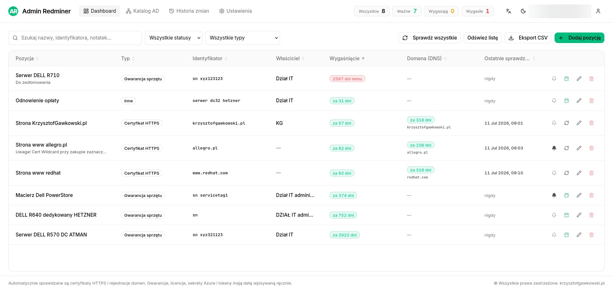
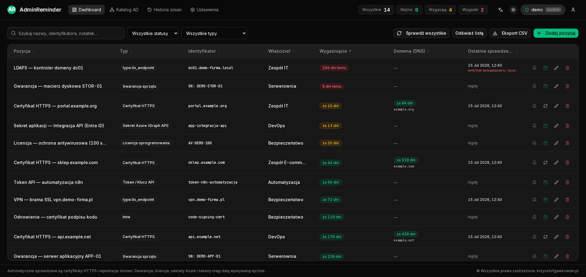
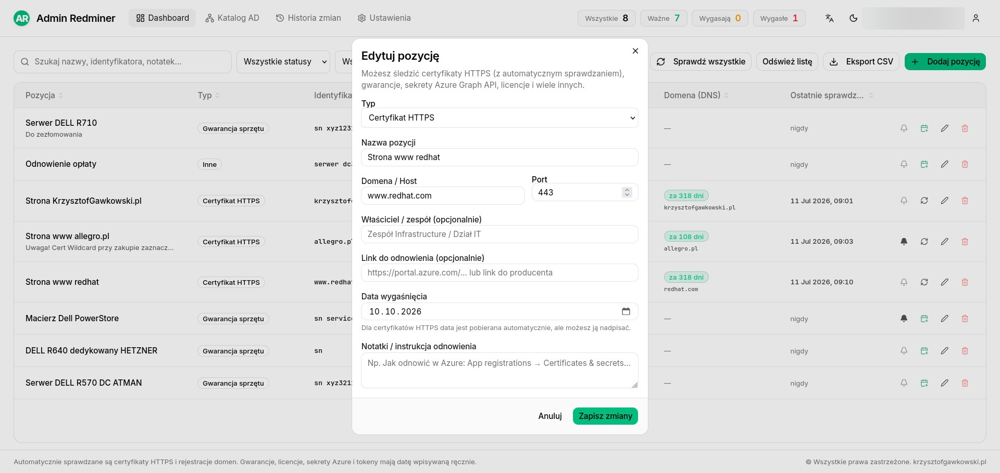
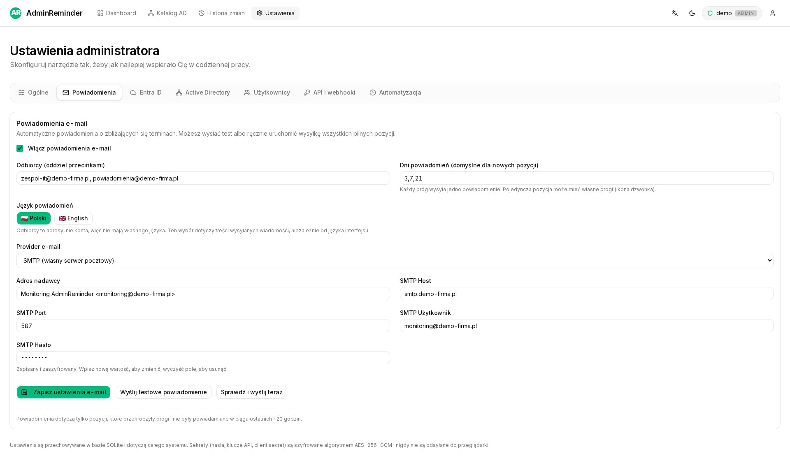
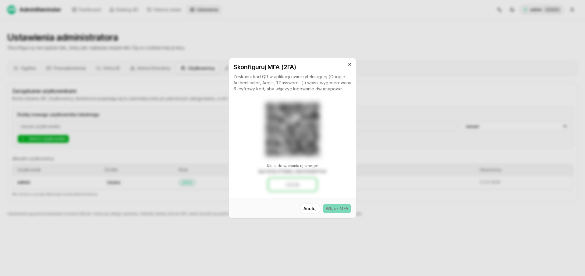

# AdminReminder

**Monitor terminów ważności — od admina dla admina.**
Pomysł i wykonanie: [www.krzysztofgawkowski.pl](https://www.krzysztofgawkowski.pl)

[English](README.md) · **Polski**

> **Demo na żywo:** **https://adminreminder.krzysztofgawkowski.pl** — zaloguj się
> `demo` / `demo123`. Demo działa w trybie tylko do odczytu (pokazuje przykładowe
> dane dla każdego typu pozycji i zakładek ustawień).

AdminReminder (AR) pomaga administratorom śledzić terminy ważności i odnowień w
jednym, szybkim i ładnym miejscu — zamiast listy w SharePoint czy Excelu:

- **Certyfikaty HTTPS** — data ważności pobierana automatycznie
- **Punkty TLS** — LDAPS, VPN, Exchange, RD Gateway i inne usługi na dowolnym
  porcie (data ważności, łańcuch, EKU, zgodność nazwy i opcjonalny pin SHA-256)
- **Certyfikaty AD CS** — Root CA i Issuing CA, czytane wprost z partycji
  Configuration w Active Directory (handshake TLS praktycznie nigdy nie
  przesyła certyfikatu Root CA, więc sama sonda na żywy port go nie złapie)
- **Gwarancje sprzętu**
- **Sekrety i certyfikaty w Entra ID / Azure** (App registrations → Graph API)
- **Tokeny / klucze API**, **licencje oprogramowania**, **rejestracje domen** (RDAP)
- oraz dowolne inne pozycje z datą ważności.



## Funkcje

### Co monitoruje

- Certyfikat HTTPS, punkt TLS (LDAPS/usługa, z walidacją łańcucha, EKU, nazwy
  i pinu), certyfikat AD CS (Root/Issuing CA), gwarancja sprzętu, sekret lub
  certyfikat Entra/Azure, token API, licencja oprogramowania, rejestracja
  domeny (RDAP) — albo cokolwiek innego, co ma datę ważności
- Certyfikat strony i rejestrację jej domeny można śledzić razem jako jedną
  pozycję — dwie niezależne daty ważności, jeden wiersz na dashboardzie
- Kolorowy dashboard (jasny i ciemny motyw), historia sprawdzeń, dziennik
  audytu, eksport CSV

### Integracja z katalogiem

- Inwentarz kont z **Active Directory** (LDAP) i **Entra ID** (Graph): termin
  ważności hasła i konta, zagnieżdżone grupy, drzewo OU
- Polityki powiadomień per-OU albo per-konto, osobne progi dla wygasania
  hasła i wygasania konta

### Powiadomienia i automatyzacja

- Powiadomienia **e-mail** (SMTP lub Resend) i **webhook**, z możliwością
  nadpisania progu dla pojedynczej pozycji
- Wbudowany harmonogram (wyrażenie cron ustawiane w interfejsie) sam
  odpala sprawdzenia i wysyła powiadomienia — bez zewnętrznego crona

### Bezpieczeństwo

- Logowanie z rolami (**admin** / **viewer**) i **MFA (TOTP)**
- **Dwie warstwy szyfrowania:**
  - każdy sekret zapisany w tabeli ustawień (hasła SMTP/AD, client secret
    Azure, klucz podpisu webhooka) jest szyfrowany osobno (AES-256-GCM) i
    nigdy nie jest odsyłany do przeglądarki
  - cała baza SQLite może być opcjonalnie szyfrowana w spoczynku przez
    **SQLCipher** (`DB_ENCRYPTION_KEY`) — włączenie tego na istniejącej,
    już zapełnionej instalacji konwertuje plik w locie przy najbliższym
    starcie, bez ręcznego eksportu/importu
- Pełny dziennik audytu działań administratora (automatyczne sprawdzenia są
  celowo pominięte, żeby dziennik nie utonął w szumie)

### REST API

Tylko-do-odczytu REST API (`/api/v1/items`, `/api/v1/accounts`) zabezpieczone
kluczami API per-integracja — do wciągnięcia dat ważności do innego
dashboardu, systemu ticketowego albo agenta AI.

### Licencjonowanie

Wersja darmowa śledzi do **5 pozycji** — dotyczy zarówno użytku prywatnego/
homelab, jak i komercyjnego. Podpisany klucz licencyjny (wydawany offline,
bez serwera licencji dzwoniącego do domu) znosi ten limit. Zobacz
[Licencja](#licencja) niżej.

### Zawsze aktualne

AdminReminder raz dziennie sprawdza, czy jest dostępne nowsze, podpisane
kryptograficznie wydanie, i pokazuje odrzucalny baner z linkiem — nigdy nic
sam nie pobiera ani nie instaluje. Aktualizacja (LXC, Docker albo instalator
Windows) zawsze pozostaje świadomą decyzją administratora.

### Interfejs

Dostępny w **7 językach** (polski, angielski, niemiecki, francuski,
hiszpański, włoski, turecki).

| Ciemny motyw | Edycja pozycji |
|---|---|
|  |  |

| Ustawienia e-mail | MFA |
|---|---|
|  |  |

## Instalacja

### Proxmox VE (LXC) — zalecane

Jedno polecenie **na hoście Proxmox** tworzy nieuprzywilejowany kontener
Debian 13, instaluje natywnie Node.js i aplikację, zakłada **pustą bazę** oraz
usługę systemd (bez Dockera, bez nestingu):

```bash
bash -c "$(curl -fsSL https://raw.githubusercontent.com/Kr1sCode/adminreminder/main/proxmox/install.sh)"
```

Po zakończeniu instalator wypisze adres `http://<IP-kontenera>:3000`. Przy
pierwszym otwarciu aplikacja poprosi o utworzenie konta administratora.

Aktualizacja: `pct exec <CTID> -- update`

Domyślnie kontener korzysta z DHCP. Na hostach ze statyczną adresacją podaj
`AR_IP=192.168.1.50/24 AR_GW=192.168.1.1` (opcjonalnie `AR_NS=1.1.1.1`).

> Pliki w układzie repozytorium community-scripts (pod przyszły PR) znajdziesz w
> katalogu [`community-scripts/`](community-scripts/).

### Docker

```bash
cp .env.example .env
docker compose -f docker-compose.prod.yml up --build -d
```

Baza SQLite trzymana jest na wolumenie (`/app/data/ar.db`).

### Windows

Dla administratorów, którzy stawiają narzędzia wprost na Windows Server, bez
Proxmoksa czy Dockera, dostępny jest natywny instalator (`.exe`): zakłada
AdminReminder jako usługę Windows (przez NSSM), podczas instalacji pyta o
port i publiczny adres, dodaje odpowiednią regułę zapory i generuje świeży
`.env` z losowymi sekretami — a przy zupełnie nowej instalacji od razu
włącza szyfrowanie bazy danych, bo nie ma jeszcze żadnych danych do migracji.
Pobierz z najnowszego [wydania](../../releases) albo zbuduj sam z katalogu
[`windows/`](windows/) (workflow GitHub Actions: `windows-installer.yml`).

### Uruchomienie lokalne (dev)

```bash
git clone https://github.com/Kr1sCode/adminreminder
cd adminreminder
npm install
cp .env.example .env.local
npm run dev
```

Otwórz **http://localhost:3000** i utwórz konto administratora.

## Konfiguracja środowiska

Ważne zmienne (`.env` / `.env.local`, wzór w [`.env.example`](.env.example)):

- `DATABASE_URL` — ścieżka do pliku bazy SQLite
- `JWT_SECRET` — **długi, losowy ciąg** (w produkcji aplikacja odmawia startu z
  wartością domyślną); `openssl rand -base64 48`
- `SETTINGS_KEY` — klucz do szyfrowania sekretów w bazie (AES-256-GCM); jeśli
  pusty, wyprowadzany z `JWT_SECRET`
- `CRON_SECRET` — sekret dla zadań automatycznych
- `DB_ENCRYPTION_KEY` — opcjonalny; szyfruje całą bazę danych w spoczynku
  przez SQLCipher (zobacz [Bezpieczeństwo](#bezpieczeństwo) wyżej)
- opcjonalnie: integracje **AD** (`AD_*`) i **Entra ID** (`AZURE_*`)

Sekrety (hasła SMTP/AD, client secret Azure) są w bazie szyfrowane i nigdy nie są
odsyłane do przeglądarki.

## Jak działa sprawdzanie

- **Certyfikaty HTTPS / Punkty TLS** — bezpośrednie połączenie TLS na wskazanym
  porcie (wbudowany moduł `tls` Node.js), odczyt `valid_to` oraz walidacja
  łańcucha, EKU `serverAuth`, zgodności nazwy (SAN/CN vs host/SNI) i — opcjonalnie
  — przypiętego odcisku SHA-256 (`pin`) wykrywającego podmianę certyfikatu.
- **Certyfikaty AD CS** — przeszukanie partycji Configuration w Active
  Directory (`CN=Certification Authorities` i `CN=AIA`), odczyt atrybutu
  `cACertificate` wprost z katalogu — bez udziału żadnego żywego punktu TLS.
- **Domeny** — przez **RDAP** (RFC 9083), endpoint rejestru wykrywany z pliku
  bootstrap IANA.

## Stos technologiczny

- Next.js 16 (App Router) + TypeScript
- Drizzle ORM + better-sqlite3 (opcjonalnie SQLCipher przez better-sqlite3-multiple-ciphers)
- shadcn/ui + Tailwind (jasny/ciemny motyw)
- Argon2 + jose (JWT / klucze licencyjne / podpisane manifesty wydań), TOTP (MFA)

## Licencja

Oprogramowanie własnościowe, source-available:

- **Prywatnie / homelab — bezpłatnie**, do **5 śledzonych pozycji**. Osoba
  fizyczna może pobierać, uruchamiać i modyfikować AR na własne, prywatne,
  niekomercyjne potrzeby (w tym domowy lab).
- **Komercyjnie — płatna licencja i zgoda autora.** Każde użycie w firmie,
  instytucji lub innej organizacji, produkcyjnie lub zawodowo, wymaga uprzedniej,
  płatnej Licencji komercyjnej.
- Klucz licencyjny znosi limit 5 pozycji w obu przypadkach — w sprawie jego
  uzyskania skontaktuj się z autorem.

Pełne warunki: [LICENSE](LICENSE). Zakup licencji i kontakt:
[www.krzysztofgawkowski.pl](https://www.krzysztofgawkowski.pl)

© 2026 Krzysztof Gawkowski. Wszelkie prawa zastrzeżone.
